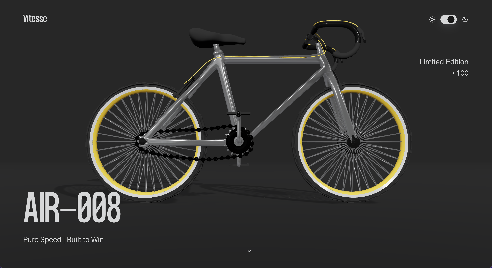
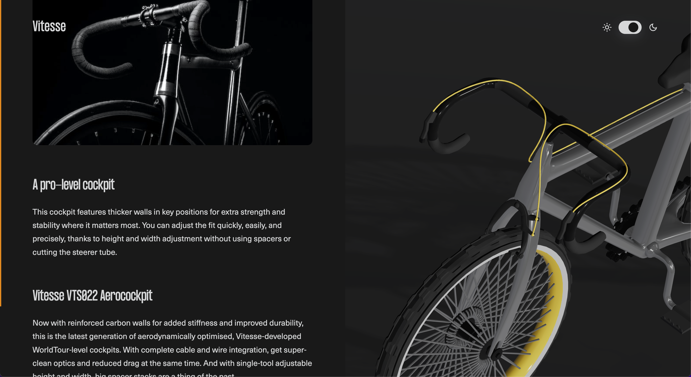

# Bike Demo Three.js

This fictive project was created to showcase my current skills using Three.js and GSAP. It was inspired by the [tutorial](https://www.youtube.com/watch?v=rxTb9ys834w&t=9266s) created by Andrew Woan based on Bokoko33's [portfolio](https://bokoko33.me/).

**[> View the live demo](https://bike-scrollanimation-threejs.vercel.app/)**

## Overview

### Built with 

- HTML, CSS, Javascript
- Three.js
- GSAP
- ASScroll
- Vite

<!-- ## Authors -->

[Syed Anas Tanweer](https://github.com/syedanastanweer/bike-scroll-animation-section-threejs-gsap)
